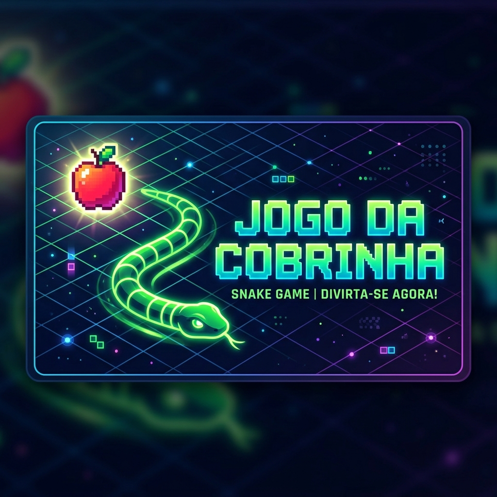

# 🐍 Jogo da Cobrinha (Snake Game)



Uma implementação clássica e vibrante do **Jogo da Cobrinha** desenvolvida em Java utilizando a biblioteca Swing. Este projeto apresenta uma versão moderna com cores dinâmicas e controles intuitivos.

## ✨ Funcionalidades

- **Cores Dinâmicas:** A cada maçã comida, a cobrinha ganha uma nova cor em seu corpo!
- **Interface Intuitiva:** Botão de Start/Restart integrado para facilitar o início e reinício da partida.
- **Placar em Tempo Real:** Acompanhe sua pontuação diretamente no topo da tela.
- **Gráficos Fluidos:** Movimentação suave e feedback visual imediato.

## 🚀 Como Executar

Para rodar este jogo em sua máquina, você precisará do **JDK (Java Development Kit)** instalado (versão 8 ou superior recomendada).

### Passos:

1. **Clone o repositório:**
   ```bash
   git clone https://github.com/CaioNunesGomesF/jogo-cobrinha.git
   cd jogo-cobrinha
   ```

2. **Compile o código fonte:**
   ```bash
   javac JogoCobrinha.java
   ```

3. **Inicie o jogo:**
   ```bash
   java JogoCobrinha
   ```

## ⚡ Jogar em um Clique (Scripts)

Para facilitar, adicionei scripts que verificam o Java, compilam (se necessário) e iniciam o jogo automaticamente:

- **Windows:** Basta dar um clique duplo no arquivo `jogar.bat`.
- **Linux/Mac:** Execute o comando `bash jogar.sh` ou torne-o executável com `chmod +x jogar.sh`.

## 🎮 Controles

| Tecla | Ação |
| :--- | :--- |
| `Seta para Cima` | Move para Cima |
| `Seta para Baixo` | Move para Baixo |
| `Seta para Esquerda` | Move para a Esquerda |
| `Seta para Direita` | Move para a Direita |

## 🛠️ Tecnologias Utilizadas

- **Linguagem:** Java
- **Interface Gráfica:** Java Swing / AWT
- **Lógica de Jogo:** Programação Orientada a Objetos e Timers

---

Desenvolvido com ❤️ por [Caio Nunes](https://github.com/CaioNunesGomesF)